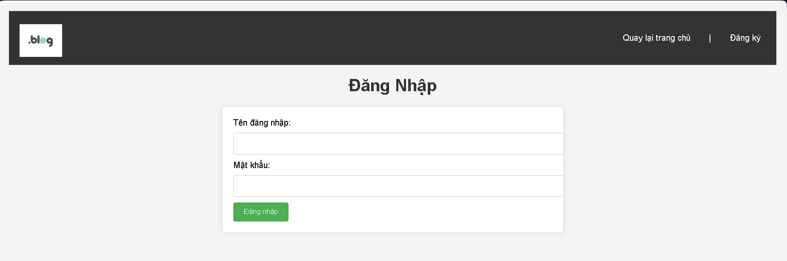

# Release Version 2

## Thay đổi chính
- Thêm chức năng đăng nhập và đăng ký người dùng.
- Tạo giao diện cho form đăng nhập và đăng ký.
- Xử lý xác thực và lưu trữ thông tin người dùng (giả lập với bộ nhớ tạm).

## Screenshots
 #Giao diện trang đăng nhập
 #Giao diện trang đăng ký
