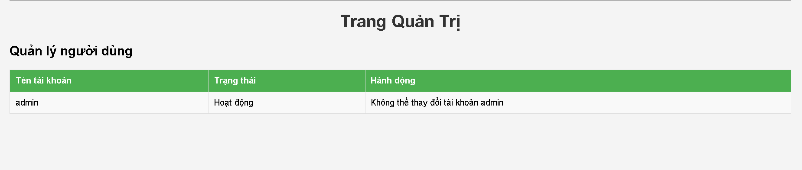
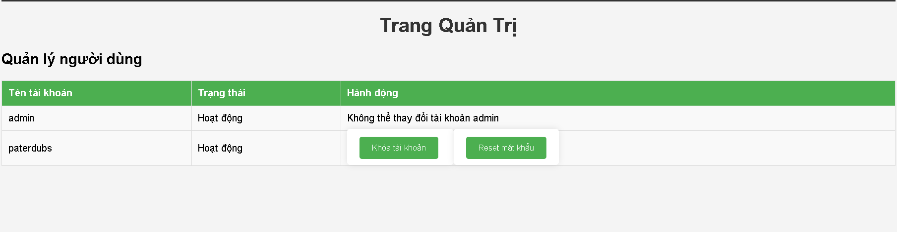
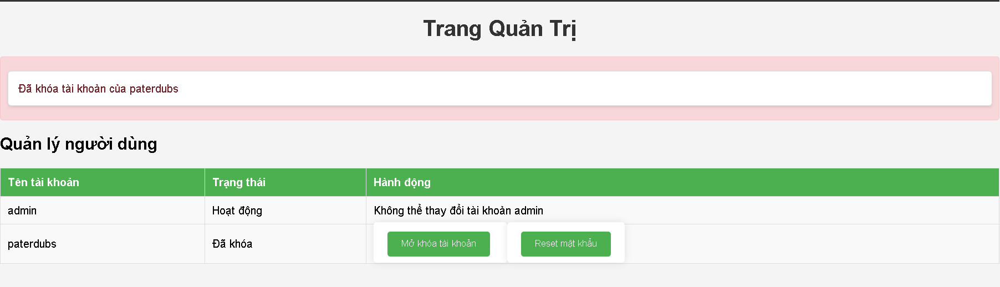
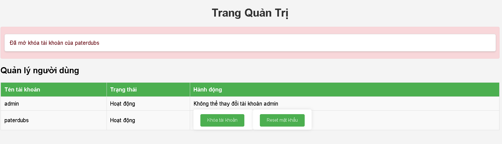
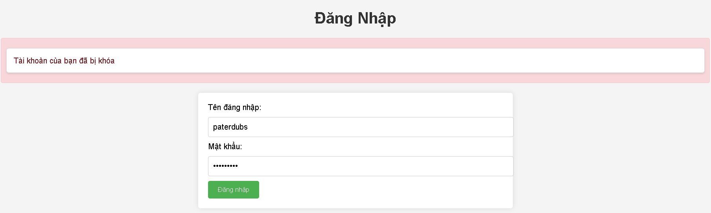
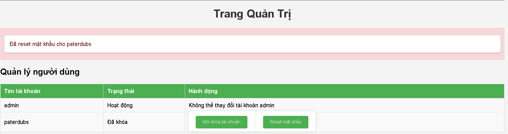

# Release Version 3

## Thay đổi chínhchính
- Thêm trang admin để quản lý người dùng.
- Cho phép admin khóa/mở tài khoản và reset mật khẩu cho người dùng với password = "defaultpassword"
- Khi user bị khóa, hiển thị thông báo “Tài khoản của bạn đã bị khóa”.

## Screenshots
: #Giao diện trang quản trị
: #Giao diện trang quản trị khi có tài khoản hoạt động
: #Giao diện trang quản trị khi thực hiện thao tác khóa khoản người dùng
: #Giao diện trang quản trị khi thực hiện thao tác mở tài khoản người dùng
: #Giao diện hiển thị "Tài khoản của bạn đã bị khóa" khi đăng nhập của người dùng
: #Giao diện trang quản trị khi thực hiện thao tác reset mật khẩu cho người dùngdùng

