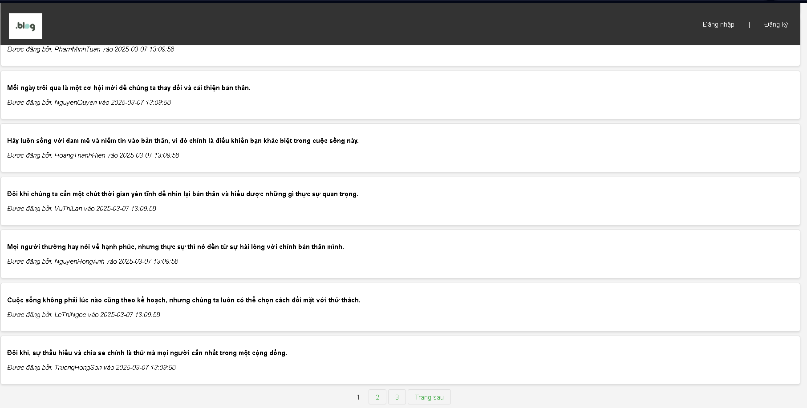

# Release Version 5

## Thay đổi chính
- Thêm dữ liệu mẫu để kiểm tra chức năng phân trang.
- Mỗi trang hiển thị tối đa 10 bài viết.
- Tạo giao diện phân trang (Next, Previous, số trang).

## Screenshots
: Giao diện khi thêm các dữ liệu ảo và thực hiện phân trang 10 bài viết/trang

